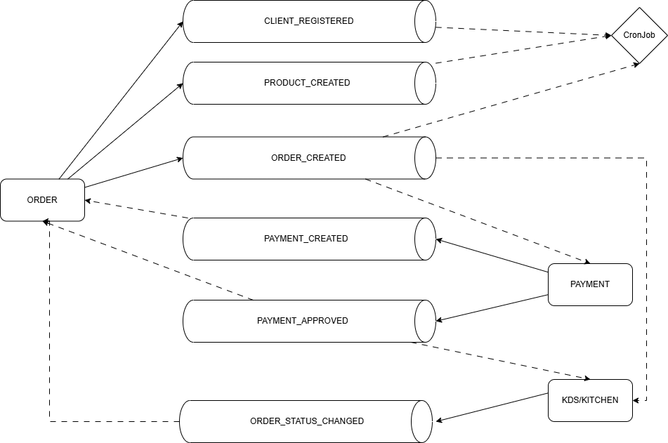
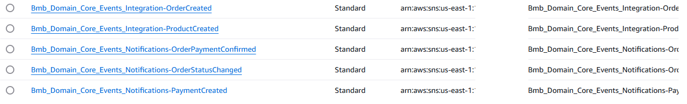
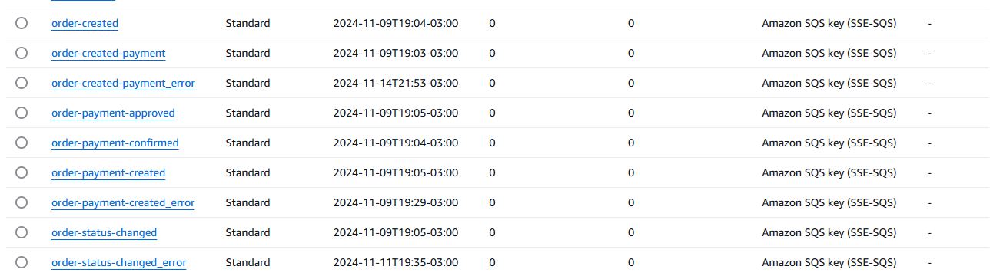

## Hi there 👋, SOAT FIAP Grupo #71

## Tech challenge deliverables
- You can find all Phase 1 deliverables on the [Wiki page](https://github.com/soat-fiap/FIAP.TechChallenge.ByteMeBurger/wiki)
- Phase 2 Deliverables
   - [Business requirements](https://github.com/soat-fiap/FIAP.TechChallenge.ByteMeBurger/wiki/Business-Requirements-Document)
   - [Infrastructure](https://github.com/soat-fiap/FIAP.TechChallenge.ByteMeBurger/wiki/Kubernetes-Infrastructure-Requirements)
   - Diagrams
     - [Sequence Diagram (Main Flow)](https://github.com/soat-fiap/FIAP.TechChallenge.ByteMeBurger/wiki/Main-flow-sequence-Diagrams-(Phase-2))
   - [Testing locally](#running-with-kubernetes-locally)
      -  to get some help with application flow testing, click [here](https://github.com/soat-fiap/FIAP.TechChallenge.ByteMeBurger?tab=readme-ov-file#testing)
   - [Video](https://www.youtube.com/watch?v=34ffDcUoUTg)
 - Phase 3 Deliverables
    - Implement an API Gateway and a serverless function for client authentication using CPF (Brazilian ID number).
        - Integrate with the authentication system to identify the client.

    - Implement CI/CD best practices, separating code into distinct repositories:
      > all repositories have the latest tag available 
      - Repository 1: [Lambda function code (tag v1.0.0)](https://github.com/soat-fiap/bmb.authenticator/tree/v1.0.0)
      - Repository 2: [Kubernetes infrastructure defined with Terraform (tag v1.0.0)](https://github.com/soat-fiap/bmb.infra/tree/v1.0.0)
      - Repository 3: [Managed database infrastructure defined with Terraform (tag v1.0.0)](https://github.com/soat-fiap/bmb.database/tree/v1.0.0)
      - Repository 4: [Application code deployed to Kubernetes (tag v1.0.0)](https://github.com/soat-fiap/FIAP.TechChallenge.ByteMeBurger/tree/v3.0.0)
      - Repository 5: [Process domain events asynchronously (tag v1.0.0)](https://github.com/soat-fiap/bmb.events.processor/tree/v1.0.0)
      - Repository 6: [Segregated repository for User management (AWS Cognito) (tag v1.0.0)](https://github.com/soat-fiap/bmb.users/tree/v1.0.0)

    - Configure automated deployments to the cloud account using actions for each repository:
      - Protect `main`/`master` branches to prevent direct commits. 
      - Enforce pull requests for all code changes.

    - Improve the chosen database's structure:
      - Document the database design following data modelling standards.
      - Justify the chosen database technology.

    - You are free to choose your preferred cloud provider but must utilize serverless services:
      - Functions: AWS Lambda, Azure Functions, or Google Cloud Functions (or similar).
      - Managed Databases: AWS RDS, Azure SQL Database, Google Cloud SQL (or similar).
      - Authentication Systems: AWS Cognito, Microsoft Azure Active Directory, Google Cloud Identity Platform (or similar).
    - [Video](https://www.youtube.com/watch?v=J2rRSJy24kM)
  - #### Phase 4 Deliverables
      > The repositories listed below can also be found on the pinned list
      - Refactor the project, separating it into at least three (3) microservices.
         - [Payment](https://github.com/soat-fiap/bmb.payment)
           - [](https://sonarcloud.io/summary/new_code?id=soat-fiap_bmb.payment)  
           - Using DynamoDB as database
           - BDD 
             - [test](https://github.com/soat-fiap/bmb.payment/blob/main/tests/Bmb.Payment.Bus.Test/Gherkin/DispatcherSteps.cs) 
             - [feature file](https://github.com/soat-fiap/bmb.payment/blob/main/tests/Bmb.Payment.Bus.Test/Gherkin/Dispatcher.feature)
           - CI/CD
             - [test](https://github.com/soat-fiap/bmb.payment/actions/runs/11982277404)
             - [deploy](https://github.com/soat-fiap/bmb.payment/actions/runs/12072866964)
        - [KDS](https://github.com/soat-fiap/bmb.production)
            - [](https://sonarcloud.io/summary/new_code?id=soat-fiap_bmb.production)
            - Using Redis as database
            - BDD 
              - [test](https://github.com/soat-fiap/bmb.production/blob/main/tests/Bmb.Production.Application.Test/Gherkin/UpdateOrderStatusSteps.cs)
              - [feature file](https://github.com/soat-fiap/bmb.production/blob/main/tests/Bmb.Production.Application.Test/Gherkin/UpdateOrderStatus.feature)
           - CI/CD
             - [tests](https://github.com/soat-fiap/bmb.production/actions/runs/11982352596)
             - [deploy](https://github.com/soat-fiap/bmb.production/actions/runs/12010846206) 

         - [Orders](https://github.com/soat-fiap/FIAP.TechChallenge.ByteMeBurger)
            - [](https://sonarcloud.io/summary/new_code?id=soat-fiap_FIAP.TechChallenge.ByteMeBurger)
            - Using MySql as database
            - BDD 
              - [test](https://github.com/soat-fiap/bmb.production/blob/main/tests/Bmb.Production.Application.Test/Gherkin/UpdateOrderStatusSteps.cs)
              - [feature file](https://github.com/soat-fiap/bmb.production/blob/main/tests/Bmb.Production.Application.Test/Gherkin/PrepareOrder.feature)
            - CI/CD
              - [tests](https://github.com/soat-fiap/FIAP.TechChallenge.ByteMeBurger/actions/runs/11982275005)
              - [deploy](https://github.com/soat-fiap/FIAP.TechChallenge.ByteMeBurger/actions/runs/12072347402)  
    - [Video](https://youtu.be/dQzKPW_0EKY)

<details>
   <summary>Pipeline flow (deprecated)</summary>
         
  ```mermaid
           graph TD
       subgraph Infrastructure
           bmb.infra["bmb.infra"]
       end
   
       subgraph Storage
           bmb.database["bmb.database"]
           bmb.users["bmb.users"]
       end
   
       subgraph API
           bmb.api["bmb.api"]
       end
   
       subgraph Integration
           bmb.authenticator["bmb.authenticator"]
           bmb.events.processor["bmb.events.processor"]
       end
   
       bmb.api --> bmb.users
       bmb.api --> bmb.database
       bmb.api --> bmb.infra
       bmb.database --> bmb.infra
       bmb.authenticator --> bmb.api
       bmb.events.processor --> bmb.api
   ```
  </details>

## Current infrastructure


### Services communication


<details open>
   <summary>Resources created by Masstransit</summary>

#### SNS


#### SQS

</details>

<!--

**Here are some ideas to get you started:**

🙋‍♀️ A short introduction - what is your organization all about?
🌈 Contribution guidelines - how can the community get involved?
👩‍💻 Useful resources - where can the community find your docs? Is there anything else the community should know?
🍿 Fun facts - what does your team eat for breakfast?
🧙 Remember, you can do mighty things with the power of [Markdown](https://docs.github.com/github/writing-on-github/getting-started-with-writing-and-formatting-on-github/basic-writing-and-formatting-syntax)
-->
